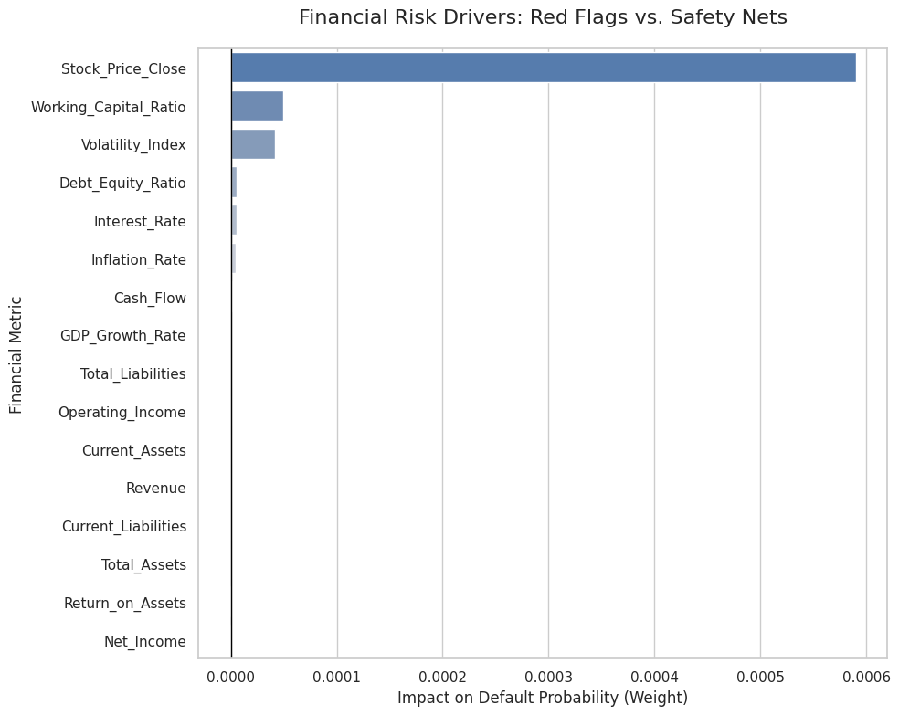

# Corporate Credit Risk Assessment & Default Prediction Model

### 📊 Project Overview
In this project, I developed a predictive model to assess the default risk of **5,000 corporate entities**. By analyzing 16 key financial metrics, including Debt, Cash Flow, and Revenue, I built a tool to identify high-risk companies, providing a data-driven approach to insurance underwriting and credit assessment.

*Figure 1: Visual breakdown of risk coefficients. Features on the right drive default predictions, while features on the left indicate financial stability.*

---

### 🏆 Key Results & Insights
* **Model Performance:** Achieved a predictive accuracy of **89.40%** on the final test set.
* **Risk Driver Analysis:** Extracted model coefficients to identify primary default indicators:
    * **Red Flags:** High **Stock Price Volatility** and **Working Capital** gaps were the strongest predictors of default risk.
    * **Safety Nets:** Robust **Net Income** and **Total Assets** were the most significant indicators of financial health.
* **Deployment:** Created a functional "Underwriter" script that processes new financial data to provide an instant **Approved/Rejected** verdict with an associated confidence probability.

---

### 🛠️ Technical Actions
* **Technology Stack:** Leveraged **Python** and its core libraries: **Pandas** and **NumPy** for data manipulation; **Matplotlib** and **Seaborn** for risk visualization.
* **Data Preprocessing:** Cleaned the dataset by handling missing values via median imputation and removing non-predictive variables such as `Company_ID`, `Date`, and `Industry_Sector`.
* **Validation Strategy:** Implemented an **80/20 train-test split** to ensure the model was evaluated on unseen data, preventing overfitting and ensuring real-world reliability.

---

### 📂 Data & Code
* **Source Code:** [View Jupyter Notebook](./GS_Credit_Risk_Engine.ipynb) — *Full Python implementation from data cleaning to model deployment*.
* **Dataset:** [Corporate Financial Risk Data](https://www.kaggle.com/datasets/the-source-link) — *Standardized dataset containing 5,000 corporate financial records*.

---

### 🔮 Future Considerations
* **Macroeconomic Stress Testing:** I plan to test this model against data from historical recessionary periods to observe how "Red Flags" shift during high market volatility.
* **Alternative Data Integration:** Incorporating non-financial metrics, such as news sentiment or credit rating changes, could potentially push model accuracy above 90%.
